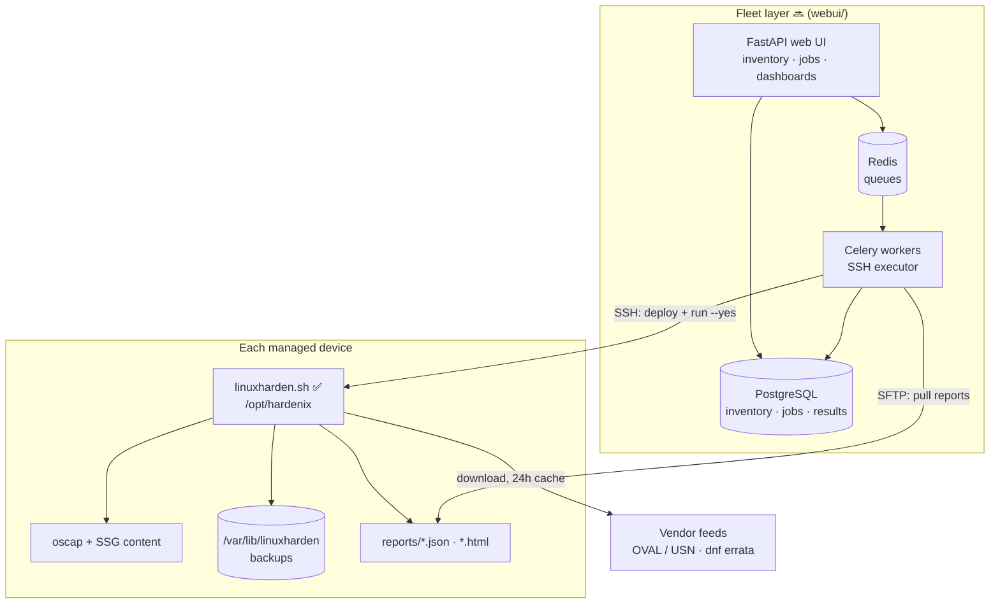

# Architecture — Final Target State

hardenix is built in two layers that share one contract:

1. **The engine** — `linuxharden.sh`, a single self-contained bash script that
   hardens, scans, patches, and reverts *one* Linux machine. ✅ shipped.
2. **The fleet layer** — a multi-user web UI (FastAPI + Celery) that keeps a device
   inventory and runs the engine over SSH on *many* machines, collecting results
   centrally. 🔜 planned ([fleet-webui.md](fleet-webui.md)).

The contract between them: the script is driven entirely by CLI flags, is fully
non-interactive with `--yes`, emits machine-readable results (`--format json`,
report files, exit codes), and is **never modified** by the fleet layer — the web
UI is purely an orchestrator.



## The layered security model

The engine covers the first three layers of a defense-in-depth stack; the later
layers are roadmap (see `todo/plan.md`):

| Layer | What | How | Status |
|-------|------|-----|--------|
| 1. Compliance hardening | CIS / ANSSI / STIG baseline | `--scan` / `--apply` / `--unapply` via `oscap xccdf eval [--remediate]` | ✅ |
| 2. Vulnerability visibility | Known CVEs in installed packages | `--scan-cve` via vendor OVAL feed or `dnf updateinfo` | ✅ |
| 3. Patching | Install security updates only | `--fix-cve` | ✅ |
| 4. Runtime detection | auditd / AIDE / fail2ban modules | FAZ 7 | 🔜 |
| 5. Drift & alerting | Scheduled scans, trend, notifications | FAZ 8 locally; fleet UI does it centrally | 🔜 |

hardenix deliberately stops there: network segmentation, SIEM, backups, and
incident response are out of scope — it is a *compliance and vulnerability
posture* tool, not a full security stack.

## Core data flows

### Harden one machine (today, ✅)

```
--scan      read-only: oscap eval → score + HTML/JSON report → ./reports/
--dry-run   read-only: same eval, prints failing rules by severity
--apply     confirm → pre-hook → BACKUP → baseline scan → oscap --remediate
            → verification scan → before/after score → post-hook
            → (optional) arm dead-man timer
--unapply   restore configs EXACTLY from backup → reinstall removed packages
            → restore service states → restorecon (SELinux) → rollback hook
```

Safety invariants (enforced in code, documented in
[script-internals.md](script-internals.md)):

- **No mutation without a backup first.** `--apply` always snapshots configs,
  enabled services, and the package list before touching anything.
- **Read-only modes stay read-only.** `--scan`, `--scan-cve`, `--dry-run` write
  only to `./reports/` and a temp dir.
- **Remote hardening is fail-safe.** `--apply --deadman N` arms a transient
  systemd timer that runs `--unapply --yes` after N minutes unless `--confirm`
  cancels it — an SSH lockout reverts itself.
- **Running services are protected.** Active NFS/SMB/Apache/nginx are detected
  before apply and their remove/disable rules excluded.

### The golden-image workflow (primary use case)

```
blank server template
   └─ linuxharden.sh --install          # oscap + SSG content
   └─ linuxharden.sh --apply --level 2  # harden to strict baseline
   └─ bake image
        └─ instantiate → layer applications on top
             └─ periodic: --scan (drift) · --scan-cve (new CVEs) · --fix-cve
```

Ordering matters: SSG masks/disables only services **present at apply time**, so
applications installed *after* hardening come up normally. Harden first, then
install apps.

### Manage a fleet (target, 🔜)

```
operator/admin (browser)
  → create job (pick devices by tag/filter, pick kind)
    → job_targets fan out to Celery queues (interactive | bulk)
      → worker: SSH connect (TOFU host key) → sudo -n bash linuxharden.sh <MODE> --yes ...
        → pull reports via SFTP → parse → scan_results row
          → dashboards: fleet score, vulnerable-device list, trends
```

Risky operations inherit the engine's safety net: the UI **always** sends
`--apply` with `--deadman <N>` (default 30 min) and exposes single and bulk
`--confirm` actions. Apply/unapply/fix-cve are admin-only (RBAC).

## Repository layout (final state)

```
hardenix/
├── linuxharden.sh          # the engine — single-file bash, no framework
├── profiles/               # one YAML per distro: SCAP profile IDs, OVAL feed,
│                           #   backup dirs, exclusions, hooks
├── docs/                   # ← you are here: architecture & internals
├── todo/                   # phased plans (Turkish): plan.md, webui-plan.md, TESTING.md
├── reports/                # generated scan output (gitignored)
├── webui/  🔜              # fleet layer: FastAPI app + Celery worker + compose
│   ├── app/                #   routes, models, auth, templates
│   ├── worker/             #   ssh.py, tasks.py, parsers.py
│   └── tests/
├── README.md / README_TR.md
└── LICENSE                 # GPL v3
```

## Design principles

1. **Single-file engine.** No runtime dependencies beyond bash, python3, and the
   distro's OpenSCAP packages; python3 replaces `bzip2`/`gzip`/XML tooling so the
   script works on minimal images.
2. **Profiles are data, not code.** Distro differences (package names, SCAP
   datastream path, profile IDs, OVAL feed URL) live in `profiles/*.yml`; the
   script contains no distro-specific hardening logic except the Arch fallback.
3. **Everything reversible.** Every mutating path has a recorded, tested inverse;
   `--unapply` restores the *exact* pre-apply state (including deleting files the
   hardening created), keeping only installed applications.
4. **Additive evolution.** Features arrive as new flags/modes phased in
   `todo/plan.md`, each with its own test gate; existing modes are not
   restructured (see `CLAUDE.md` hard constraints).
5. **Orchestrate, don't fork.** The fleet layer treats the engine as an opaque,
   versioned artifact: deploy = SFTP push + sha256 verify; upgrade = redeploy.
