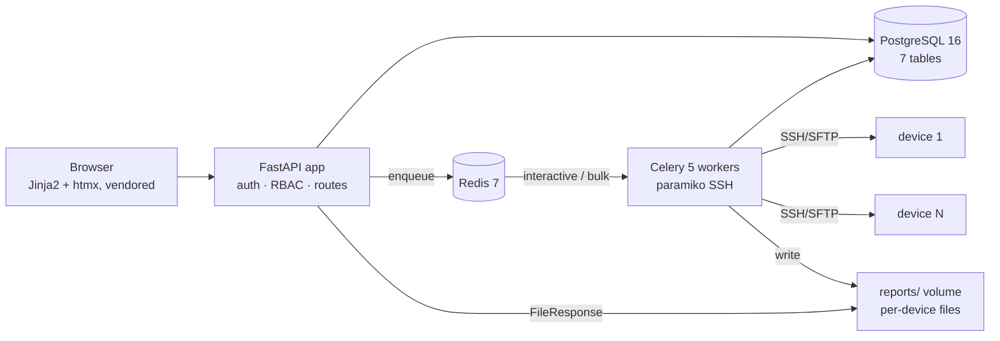
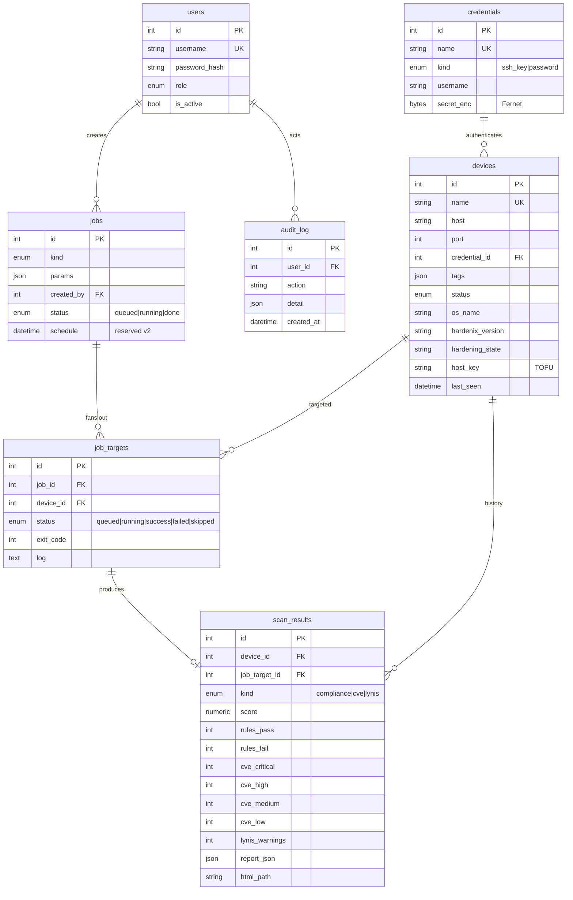

# Fleet Web UI — Target Architecture 🔜

Status: **designed, not yet built.** The authoritative, phase-by-phase build plan
is `todo/webui-plan.md` (FAZ W0–W8); its approved design decisions are binding.
This document describes the *final state* that plan produces.

## What it is

A multi-user web application that keeps a device inventory, deploys
`linuxharden.sh` to `/opt/hardenix` on each device over SSH, runs bulk operations
(install / scan / scan-cve / fix-cve / apply / unapply / lynis), and collects
scores, CVE counts, and reports centrally. Scale target: 10–20 devices today,
1000 later — same architecture, more workers.

**Prime directive: the script is not modified.** The UI orchestrates the engine
through its existing non-interactive interface (`--yes`, `--format json`,
`--deadman`/`--confirm`, report files, exit codes).

## Components



Docker Compose runs it all: `api` + `worker` (same image, non-root), `postgres:16`,
`redis:7`, healthchecks everywhere, the repo root mounted **read-only** into the
worker (deploy always pushes the current script — "upgrade" = redeploy).

## Data model



`scan_results.score` semantics: compliance % for `compliance`, NULL for `cve`,
Lynis hardening index (0–100) for `lynis`. Reports themselves live **on disk**
(`reports/<device_id>/`, newest 10 retained), never in the database.

## Job engine

Job kinds: `ping · deploy · install · scan · scan_cve · fix_cve · apply · unapply
· confirm · key_rollout · lynis_audit`.

A job fans out into one `job_target` per device. Single entry point
`run_job_target(job_target_id)` dispatches on kind and always lands its outcome in
`job_targets.status / exit_code / log` — failures are recorded, never swallowed.

| Discipline | Rule |
|------------|------|
| Queues | Two: `interactive` (single-device actions) and `bulk` — a 500-device scan can't starve a ping |
| Reliability | `acks_late=True`, `prefetch_multiplier=1` |
| Timeouts (s) | connect 15 · ping 30 · deploy 120 · install 900 · scan/scan-cve/fix-cve/unapply 1800 · apply 3600 |
| Retry | exactly once, only on *connection* errors, 60 s later — a non-zero script exit is a result, not a retry |
| Live tracking | htmx polls a counter summary (success/failed/queued/running) every ~2 s; no per-target streaming |

Remote execution pattern:

```
cd /opt/hardenix && sudo -n bash linuxharden.sh <MODE> --yes [flags]
```

(`sudo -n` dropped when the SSH user is root; otherwise NOPASSWD sudo is required.)
Deploy = `mkdir -p /opt/hardenix` (mode 700) → SFTP push script + profiles →
remote `sha256sum` verification → record `hardenix_version` in inventory.

### Result collection

- **scan**: `--scan --format both --yes` → pull newest `scan_*.json` + `.html` →
  `parse_scan_json()` → `scan_results`.
- **scan-cve**: parse the summary output (+ pull HTML when produced).
- **fix-cve**: runs, then automatically chains a scan-cve to verify.
- **lynis** (second opinion, independent of OpenSCAP): install if missing →
  `lynis audit system --quiet` → pull `/var/log/lynis-report.dat` → hardening
  index + warnings/suggestions into `scan_results`.

Dashboards are SQL aggregations (never Python loops over tables): fleet score
averages, CVE totals by severity, top-10 riskiest devices (critical+high), and
per-device + fleet **trend timelines** rendered as inline SVG (no chart libraries,
no CDN — all assets vendored).

## Security model

| Concern | Design |
|---------|--------|
| AuthN | argon2 password hashes (passlib); signed httpOnly session cookie |
| AuthZ | RBAC enforced server-side by `require_role()`: `viewer` (read) < `operator` (ping/deploy/install/scan/scan-cve) < `admin` (apply, unapply, fix-cve, key-rollout, user & credential management) |
| Secrets | SSH keys/passwords Fernet-encrypted at rest; master key only from `HARDENIX_MASTER_KEY` env; secrets never re-displayed, never logged; a DB dump alone reveals nothing |
| Host keys | TOFU: recorded on first contact into `devices.host_key`, hard-fail on mismatch |
| Dangerous ops | UI `--apply` **always** carries `--deadman <N>` (default 30, cannot be disabled); typed confirmation ("APPLY") in the wizard; single + bulk Confirm actions send `--confirm`; every privileged action → `audit_log` |
| Fleet hygiene | `key_rollout` job converts password-auth devices to the managed SSH key (idempotent `authorized_keys` append → flip credential → verify ping) |

## Scaling path

Designed-in from day one rather than retrofitted: server-side pagination on every
list (50/page), reports on disk with retention, two queues, SQL-aggregated
dashboards, counter-based polling. Going from 20 to 1000 devices is
`docker compose up --scale worker=4` — validated by a 100-container sshd load test
(FAZ W8) before the 1000-device claim is made.

Deliberately deferred to v2: scheduled scans (Celery Beat; `jobs.schedule` column
already reserved), e-mail/webhook alerts, pull-agent mode for 5000+/NAT devices,
LDAP/SSO.
